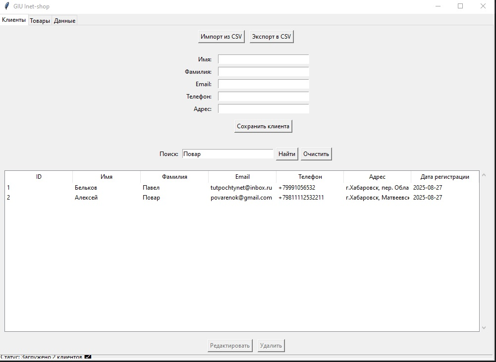
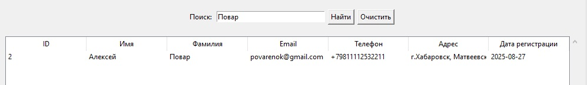
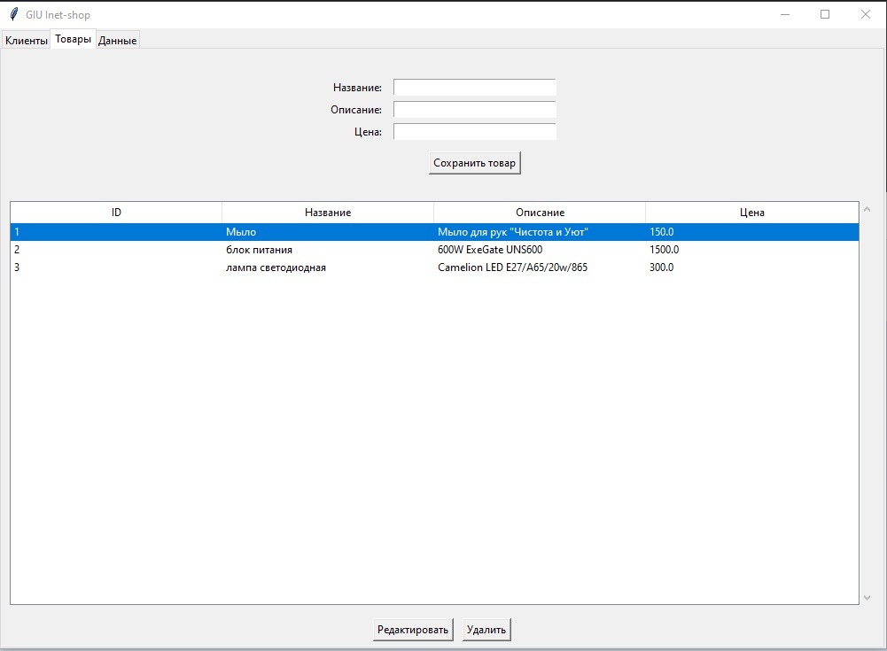

<div align="center" style="background-image: url('https://github.com/belkovpv-rspd/LA_level1/raw/1d944c4b7d721afa921865ac3a55bd724796df5f/end_att_bg.jpg'); background-size: cover; padding: 40px; color: white; border-radius: 10px;">
  <h1>Итоговая аттестация</h1>
</div>

## Данный проект создан в рамках моего обучения по программе от Университета Иннополис:
 - «Программная инженерия. Разработка ПО (Python для начинающих специалистов)»


# 🛒 Интернет-магазин — Управление и статистика

Простое приложение для управления интернет-магазином с графическим интерфейсом на **Tkinter**, базой данных **SQLite** и визуализацией статистики. Позволяет управлять клиентами, товарами, заказами и просматривать аналитику.


---

## 📋 Основные функции

- **Управление клиентами**: добавление, редактирование, удаление, поиск.
- **Управление товарами**: добавление, редактирование, удаление.
- **Управление заказами**: оформление, просмотр, удаление.
- **Статистика и аналитика**:
  - Топ-5 клиентов по заказам
  - Динамика заказов по датам
  - Граф связей клиентов и товаров
- **Экспорт данных** в CSV
- **Автоматическая валидация** данных (email, телефон, цена и т.д.)
- Полное **юнит-тестирование** и **документация Sphinx**

---

### 🛠 статус готовности блоков
- ✅ **Управление клиентами**
- ✅ **Управление товарами**
- ❌**Управление заказами**
- ❌**Статистика и аналитика**
- ✅**Экспорт данных** в CSV
- ✅**Автоматическая валидация**
- ❌Полное **юнит-тестирование** и **документация Sphinx**


---
## ⛓️ Структура проекта
```
PythonProject2/
        ├── main.py            # Точка входа в приложение
        ├── models.py          # Классы данных: Customer, Product, Order
        ├── db.py              # Работа с базой данных (SQLite или файлы)
        ├── gui.py             # Графический интерфейс (Tkinter)
        ├── analysis.py        # Анализ данных и визуализация
        ├── utils.py           # Вспомогательные функции
        ├── tests/             # Каталог для модульных тестов
        │   ├── test_models.py
        │   └── test_analysis.py
        ├── docs/              # Каталог для документации (Sphinx)
        │   └── ...          # Сгенерированные файлы документации
        ├── README.md          # Описание проекта
        └── .gitignore         # Файл для исключения файлов из Git/
```
## 📋 Описание модулей

 - ### main.py (Точка входа)
#### Назначение: 
Запускает графический интерфейс приложения.
#### Функционал:
Импортирует необходимые модули (gui).
Создает экземпляр главного окна интерфейса.
Запускает основной цикл событий Tkinter.
```Phyton
import tkinter as tk
from tkinter import ttk
from gui import MainApplication

if __name__ == "__main__":
    app = MainApplication()
    app.mainloop()
```
 - ### models.py (Классы данных)
#### Назначение: Определяет классы для представления данных: клиентов, товаров, заказов.
##### Классы:
- Client:
  - Атрибуты:client_id, first_name, last_name, email, phone, address.
  - Методы: __init__, __repr__, add_order
- Product:
  - Атрибуты: product_id, name, description, price.
  - Методы: __init__, __repr__.
- Order:
  - Атрибуты: order_id, client, products: List[Product], order_date, status.
  - Методы: __init__, add_product, calc_total, __repr__.

```Phyton
@dataclass
class Client(Person):
    """
    наследуется от класса Person
    client_id = уникальный идентификатор клиента  int
    address = адрес клиента str
    registration_date = дата регистрации клиента datetime
    orders = список заказов клиента list[order]
    """

    def __init__(self, first_name: str, last_name: str, email: str, phone: str, address: str):
        super().__init__(first_name, last_name, email, phone)
        self.client_id: Optional[int] = None  # ID устанавливаются как Optional[int] = None и будут заполняться базой данных при сохранении
        self.address = address

```
 - ### db.py (Работа с базой данных)
##### Назначение: Обеспечивает взаимодействие с базой данных (SQLite) или файлами (CSV)
##### Функционал:
  - Подключение к базе данных (SQLite).
  - Создание таблиц (если необходимо).
  - Реализация функций для добавления, чтения, обновления и удаления данных о клиентах, товарах и заказах.
  - Функции для импорта и экспорта данных в/из CSV .
```Phyton
import sqlite3
import csv
from datetime import datetime
from typing import List, Dict, Union
from models import Product, Client, Order

database_name = "eshop.db"


def create_tables():
    conn = sqlite3.connect(database_name)
    cursor = conn.cursor()
```
```Phyton
def add_client(client: Client):
    """ добавляем клиента в БД"""
    conn = sqlite3.connect(database_name)
    cursor = conn.cursor()

    cursor.execute("""
    INSERT INTO clients (first_name, last_name, email, phone, address, registration_date)
    VALUES (?, ?, ?, ?, ?, ?)
    """, (client.first_name, client.last_name, client.email, client.phone, client.address,
          client.registration_date.isoformat()))

    client.client_id = cursor.lastrowid  # получаем айди клиента
    conn.commit()
    conn.close()
```
 - ### gui.py (Графический интерфейс)
##### Назначение: Создает графический интерфейс пользователя с использованием Tkinter.
##### Функционал:
  - Главное окно приложения.
```Phyton
class MainApplication(tk.Tk) :
    """
    Главное приложение с вкладками.
    """

    def __init__(self) :
        super().__init__()
        self.title("GIU Inet-shop")
        self.geometry("1000x700")

        # Создаем вкладки
        self.notebook = ttk.Notebook(self)
        self.notebook.pack(fill=tk.BOTH, expand=True)

        # Создаем фреймы для вкладок
        self.clients_frame = ttk.Frame(self.notebook)
        self.products_frame = ttk.Frame(self.notebook)
        self.data_frame = ttk.Frame(self.notebook)

        # Добавляем вкладки
        self.notebook.add(self.clients_frame, text="Клиенты")
        self.notebook.add(self.products_frame, text="Товары")
        self.notebook.add(self.data_frame, text="Данные")

        # Инициализируем вкладки
        self.init_clients_tab()
        self.init_products_tab()
        self.init_data_tab()
```
  - Формы для добавления клиентов, товаров, заказов.
```Phyton
    def init_clients_tab(self) :
        """Инициализация вкладки клиентов."""
        # Панель управления
        control_frame = ttk.Frame(self.clients_frame)
        control_frame.pack(pady=10)
```
```Phyton
    def init_products_tab(self) :
        """Инициализация вкладки товаров."""
        # Панель управления
        control_frame = ttk.Frame(self.products_frame)
        control_frame.pack(pady=10)
```
```Phyton
    def init_data_tab(self) :
        """Инициализация вкладки данных."""
        info_frame = ttk.Frame(self.data_frame)
        info_frame.pack(pady=20)

```

  - Списки для отображения данных.
```Phyton
        tree_frame = ttk.Frame(self.clients_frame)
        tree_frame.pack(fill=tk.BOTH, expand=True, padx=10, pady=10)

        self.tree = ttk.Treeview(tree_frame,
                                 columns=("ID", "Имя", "Фамилия", "Email", "Телефон", "Адрес", "Дата регистрации"),
                                 show='headings', height=15)

        columns = ["ID", "Имя", "Фамилия", "Email", "Телефон", "Адрес", "Дата регистрации"]
        for col in columns :
            self.tree.heading(col, text=col)
            self.tree.column(col, width=100)
```
  - Кнопки для выполнения действий.
```Phyton
edit_frame = ttk.Frame(self.products_frame)
        edit_frame.pack(pady=5)

        self.edit_product_btn = tk.Button(edit_frame, text="Редактировать", command=self.edit_product,
                                          state=tk.DISABLED)
        self.edit_product_btn.pack(side=tk.LEFT, padx=5)

        self.delete_product_btn = tk.Button(edit_frame, text="Удалить", command=self.delete_product, state=tk.DISABLED)
        self.delete_product_btn.pack(side=tk.LEFT, padx=5)
```
  - Фильтры и поля для поиска.
```Phyton
search_frame = ttk.Frame(self.clients_frame)
        search_frame.pack(pady=10)

        self.search_label = tk.Label(search_frame, text="Поиск:")
        self.search_label.pack(side=tk.LEFT)

        self.search_entry = tk.Entry(search_frame, width=30)
        self.search_entry.pack(side=tk.LEFT, padx=5)

        self.search_btn = tk.Button(search_frame, text="Найти", command=self.search_clients)
        self.search_btn.pack(side=tk.LEFT)
```
  - Обработчики событий для взаимодействия с пользователем.
```Phyton
        self.status_bar.config(text=f"Статус: Загружено {len(clients)} клиентов ✅")
        except Exception as e :
            messagebox.showerror("Ошибка", f"Не удалось загрузить клиентов: {str(e)}")
            self.status_bar.config(text="Статус: Ошибка загрузки клиентов ❌")
```
 - ### analysis.py (Анализ данных и визуализация)
- ❌ файл создан но не используется в gui , необходима доработка 

#### Назначение: Содержит функции для анализа данных и построения визуализаций.
#### Функционал:

  - Топ-5 клиентов по количеству заказов.
  - Динамика количества заказов по датам.
  - Построение графа связей клиентов (по географии/общим товарам).
  - Использование библиотек pandas, matplotlib, seaborn, networkx.


---

## 🖼 Скриншоты интерфейса

#### Вкладка управления клиентами

#### Демонстрация возможности поиска, работает по всем колонкам.


#### Вкладка управления товарами

---

## 🛠 Технологии

- **Python 3.13** — основной язык.
- **Tkinter** — графический интерфейс.
- **Matplotlib** — построение графиков.
- **NetworkX/seaborn/pandas** — построение и анализ графов.
- **adjust-text** — умное позиционирование текста.
- **SQLite** — локальная база данных (или PostgreSQL/MySQL — при необходимости).

---
## 🚀 Быстрый запуск

### 1. Клонируйте репозиторий
```
git clone https://github.com/belkovpv-rspd/LA_level1.git
cd web_shop-app
```
### 2. Установите зависимости:
```
pip install -r requirements.txt
```
### 3. Запустите приложение:
```
python main.py
```
